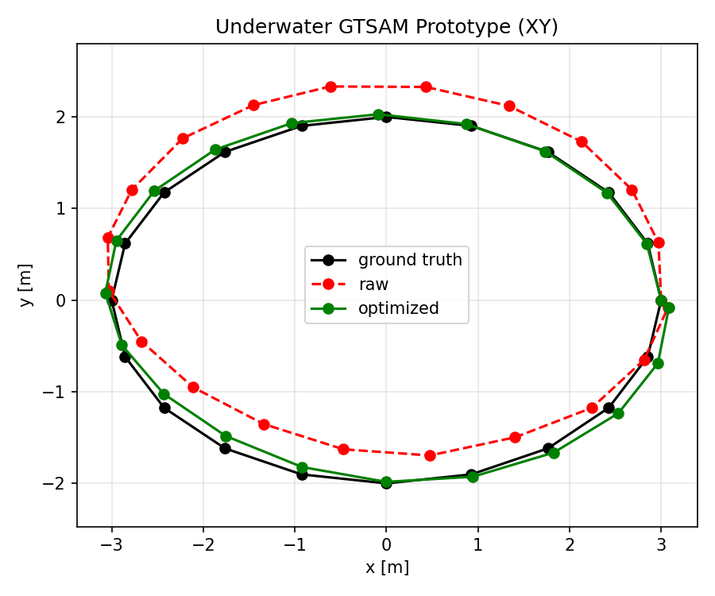
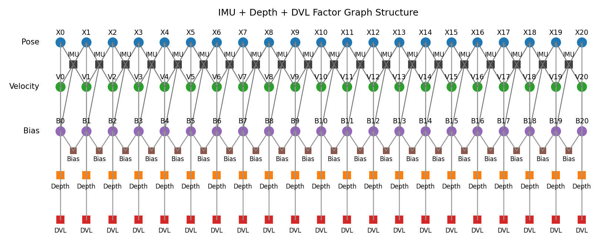
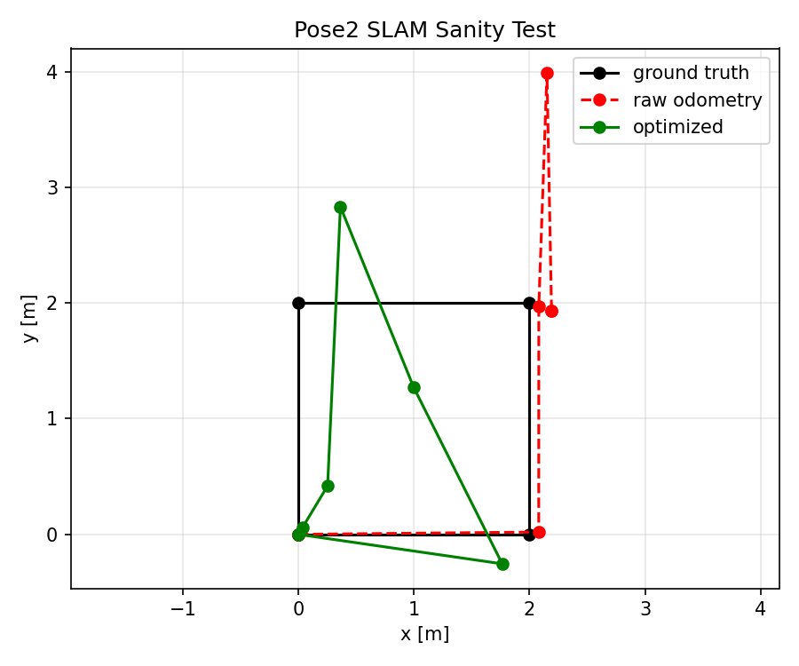
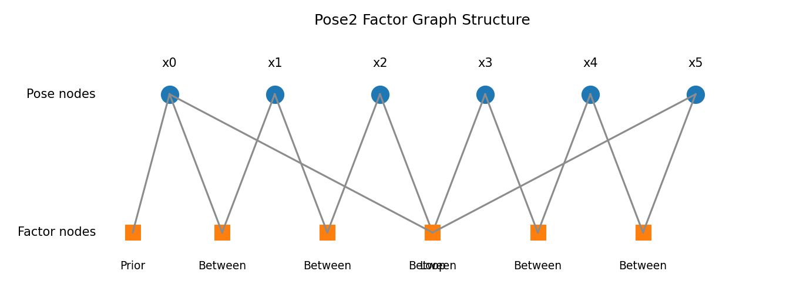
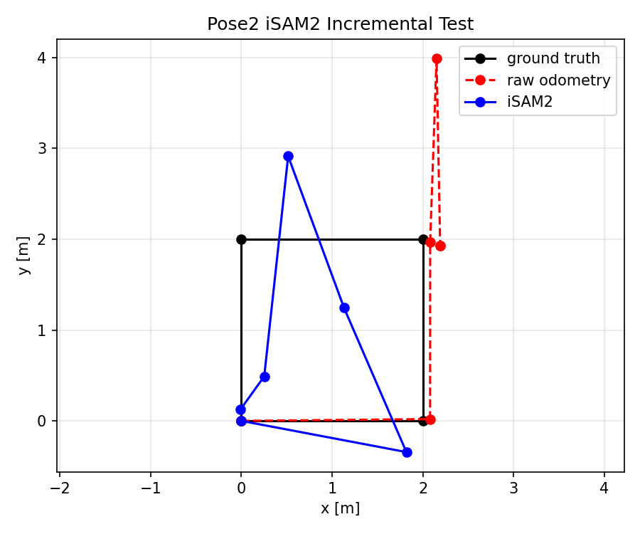
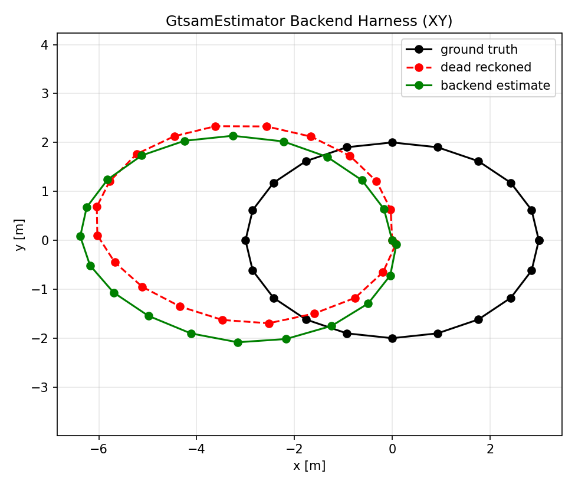
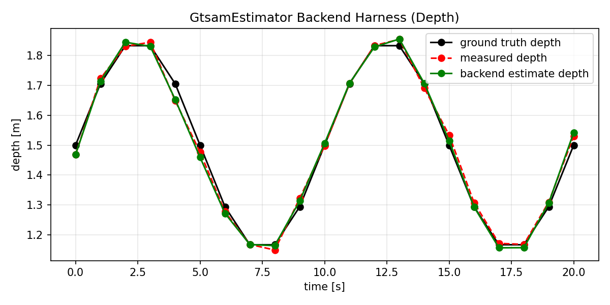
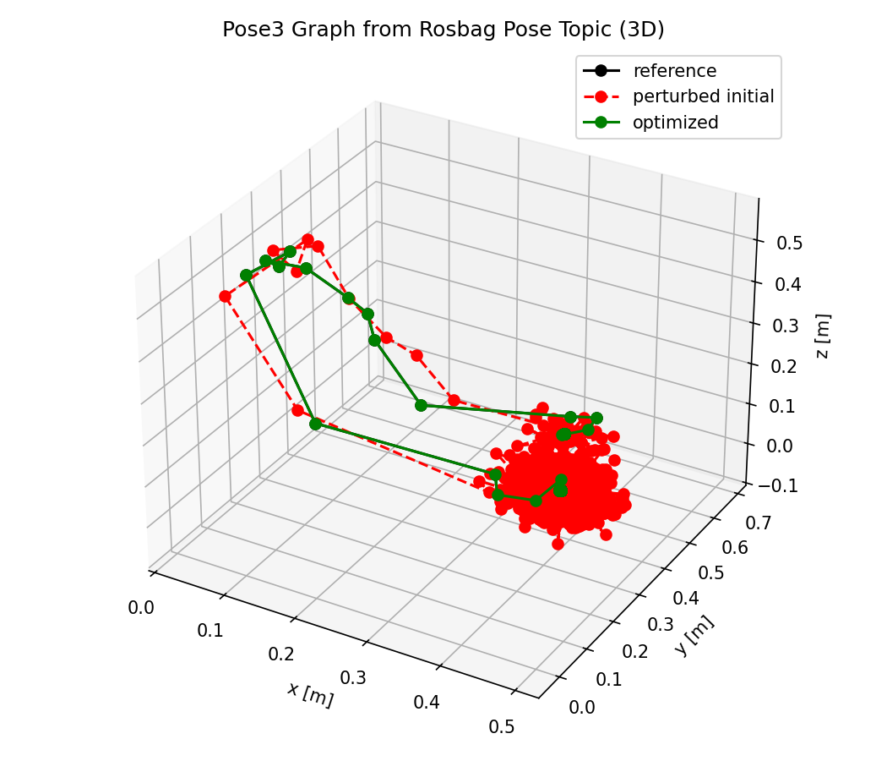
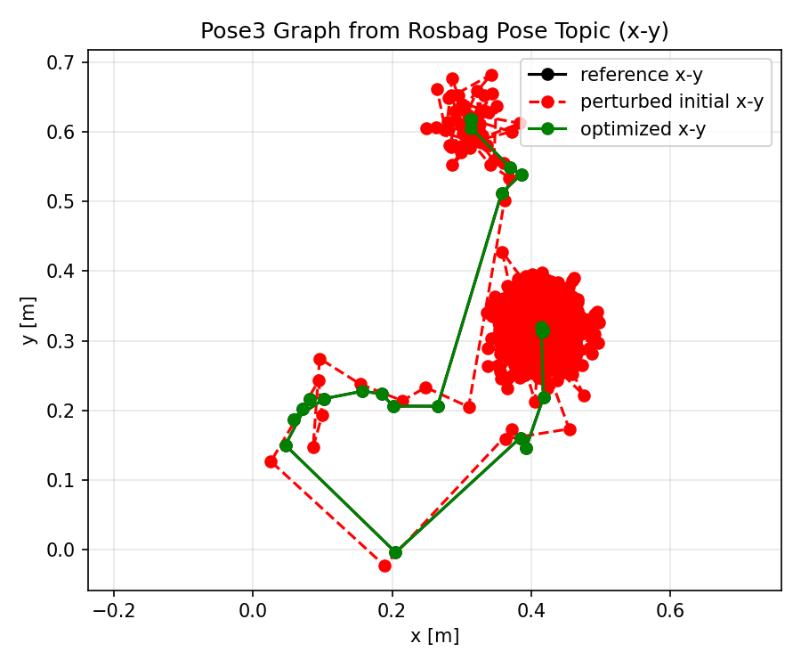
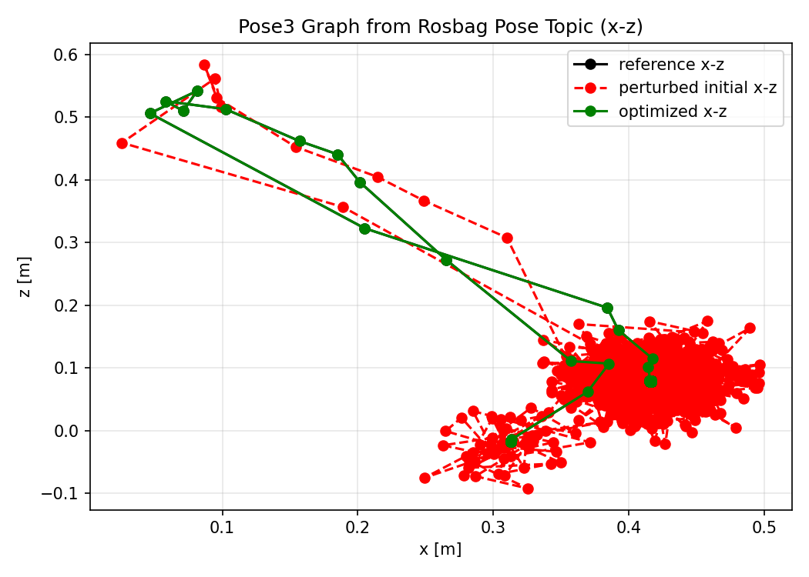

# gtsam_minimal_experiment

Minimal offline GTSAM validation tests for the USC autonomous underwater
vehicle software stack.

This project is meant to be the safe place to test factor-graph ideas before
moving them into the live ROS2 estimator. In practice, that matters because
live sensor reading is not always successful during hardware sessions:

- cameras can reboot or disconnect
- DVL or depth sensors may be unavailable
- IMU, DVL, depth, and camera topics may not all be live at the same time
- container/runtime issues can hide whether a graph problem is caused by the
  math or by the deployment environment

Because of that, this repository focuses on offline, repeatable, small-scope
GTSAM tests that let us validate graph structure, measurements, and outputs
without depending on a perfect live run every time.

## What this repository tests

### 1. Synthetic underwater multi-sensor graph

- `generate_synthetic_dataset.py`
- `run_gtsam_localization.py`

This is the main underwater-oriented offline prototype. It tests:

- IMU-style motion propagation / preintegration structure
- depth constraints
- DVL velocity constraints
- pose / velocity / bias state layout
- batch GTSAM optimization

The synthetic underwater graph is built from standard GTSAM library primitives
and then adapted to the Barracuda AUV measurement layout. In particular, this
test uses the same core ideas as GTSAM's inertial and factor-graph workflows:

- `PreintegrationParams.MakeSharedU`
- `PreintegratedImuMeasurements`
- `ImuFactor`
- `PriorFactorPose3`
- `PriorFactorVector`
- `PriorFactorConstantBias`
- `BetweenFactorConstantBias`
- `GPSFactor` for the depth-style position constraint
- `LevenbergMarquardtOptimizer`

So the graph structure is not invented from scratch here; it is a Barracuda-
specific offline experiment built on top of the standard GTSAM factor and IMU
preintegration machinery.

Outputs include:

- trajectory plots
- depth plots
- factor-graph diagrams
- metrics

Example output:




### 2. Simple Pose2 batch sanity test

- `pose2_slam_sanity.py`

This is a small reference graph for checking the basics:

- prior factor setup
- `BetweenFactorPose2`
- loop closure
- batch optimization behavior

Outputs include:

- raw vs optimized trajectory plots
- factor-graph diagram
- simple error metrics

Example output:




### 3. Simple Pose2 incremental iSAM2 test

- `pose2_isam2_incremental.py`

This is the incremental version of the simple pose graph. It is useful for
checking:

- online/incremental graph update flow
- basic `iSAM2` usage
- how incremental estimates compare to raw odometry

Example output:



### 4. Backend-only replay test for the ROS2 estimator backend

- `replay_estimator_backend.py`

This script replays the synthetic underwater dataset directly through
`barracuda_estimation.gtsam_estimator.GtsamEstimator` without ROS2. It is the
closest offline test of the actual estimator backend logic.

It checks:

- IMU buffering
- depth ingestion
- DVL ingestion
- backend update flow
- step-by-step estimator status

Example output:




### 5. Rosbag-to-dataset conversion for underwater inputs

- `rosbag_to_gtsam_dataset.py`

This converts a ROS2 bag into the `.npz` format expected by the offline
underwater runner.

It currently supports:

- `/barracuda/imu/data`
- `/barracuda/depth`
- `/barracuda/dvl/odometry`

and can handle:

- `sensor_msgs/msg/Range`
- `sensor_msgs/msg/FluidPressure`

### 6. Rosbag recording helper

- `record_barracuda_rosbag.sh`

Small helper script for recording Barracuda estimation topics into a ROS2 bag.

### 7. Real-data fallback Pose2 graph from a live pose topic

- `run_pose2_from_rosbag.py`

When the full sensor stack is not available but we still have a live pose topic
like `/barracuda/zed_node/pose`, this script builds a simple offline Pose2
graph from the recorded rosbag pose stream.

It is useful for:

- real-data fallback testing
- checking that the factor-graph pipeline works at all
- validating pose-graph behavior without DVL/depth

### 8. Real-data offline Pose3 graph from a live pose topic

- `run_pose3_from_rosbag.py`

This is the 3D version of the rosbag pose test. It keeps:

- `x`
- `y`
- `z`
- full 3D orientation

It is useful when we want to verify that:

- vertical motion is preserved
- orientation is not flattened into a 2D yaw-only result
- the live pose stream can be tested in full 3D offline

Outputs include:

- `trajectory_xy.png`
- `trajectory_xz.png`
- `trajectory_xyz.png`
- `factor_graph.png`
- `metrics.json`

Example output:





## Why these tests matter

These tests are intentionally smaller and cleaner than the final vehicle stack.
They let us answer questions like:

- is the graph structure correct?
- are we using the right factors?
- does `z` survive a Pose3 pipeline?
- is a bug caused by GTSAM logic or by live ROS deployment?
- can we still validate progress when hardware is partially unavailable?

The goal is to make it easier to debug and iterate on GTSAM for the USC
autonomous underwater vehicle before moving validated pieces into
`barracuda_estimation`.

Because the workflow is rosbag-based, these tests are also useful beyond this
specific vehicle stack. The same offline validation pattern can be reused for
other ROS2 robotics systems that record pose, IMU, odometry, depth, or similar
sensor topics and want to test factor-graph estimation without depending on a
perfect live run.

## Run

```bash
python3 generate_synthetic_dataset.py
python3 run_gtsam_localization.py
python3 pose2_slam_sanity.py
python3 pose2_isam2_incremental.py
python3 replay_estimator_backend.py
python3 run_pose2_from_rosbag.py /root/bags/my_bag
python3 run_pose3_from_rosbag.py /root/bags/my_bag
```

Convert a real Jetson rosbag into an underwater dataset and generate a factor
graph:

```bash
python3 rosbag_to_gtsam_dataset.py /root/bags/my_bag \
  --output data/jetson_rosbag_underwater.npz
python3 run_gtsam_localization.py \
  --dataset data/jetson_rosbag_underwater.npz \
  --output-dir results_jetson_rosbag
```

If DVL or depth is unavailable but you still have `/barracuda/zed_node/pose`,
you can still generate a fallback factor graph with:

```bash
python3 run_pose2_from_rosbag.py /root/bags/my_bag \
  --pose-topic /barracuda/zed_node/pose \
  --output-dir results_pose2_rosbag
```

If you want to verify `z` directly from the same rosbag pose topic, use:

```bash
python3 run_pose3_from_rosbag.py /root/bags/my_bag \
  --pose-topic /barracuda/zed_node/pose \
  --output-dir results_pose3_rosbag
```

## Outputs

Scripts write results under:

- `results_underwater/`
- `results_jetson_rosbag/`
- `results_pose2_rosbag/`
- `results_pose3_rosbag/`
- `results_backend_harness/`
- `results_pose2_batch/`
- `results_pose2_isam2/`

The batch test also writes:

- `results_pose2_batch/factor_graph.png`

The underwater prototype also writes:

- `results_underwater/factor_graph.png`

## Intended workflow

Recommended workflow for this repository:

1. validate small graphs first
2. validate synthetic underwater multi-sensor graphs
3. validate rosbag-based fallback graphs from real topics
4. replay cleaned-up logic into the ROS2 estimator backend
5. only then move stable graph logic into the live estimator package
